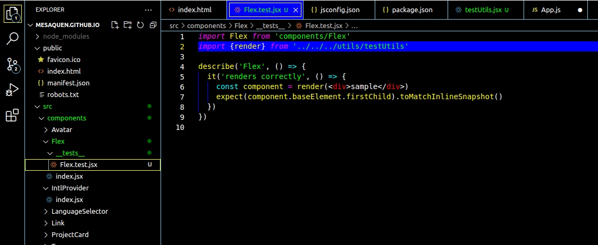

# @mesaquen High Contrast Theme
This is my personal vscode theme. A high contrast theme, since I'm getting old and having issues with low contrast UI. 

This theme has a color limitation on purpose. It only used 8-bit colors and 2-bit grayscale.

## The problem
Since I started having trouble identifying characters on those low contrast themes, I started using high contrast themes (on [MS Teams]).

As I got used to that, this is my first attempt of having that feel on my current text editor :heart:.

# Development
The theme still under development mainly focusing on **JS, Typescript and Markdown** syntax highlight. 

## Preview


## Installing

You can find it on the [marketplace].

To install directly via VS Code. Launch VS Code Quick Open (`Ctrl+P`), paste the following command, and press enter.
```
ext install mesaquen.mesaquen-hc-theme
```

[MS Teams]: https://microsoft.com/teams
[marketplace]: https://marketplace.visualstudio.com/items?itemName=mesaquen.mesaquen-hc-theme
