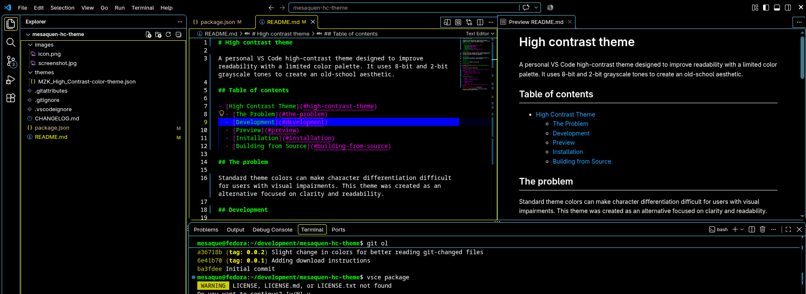

# High contrast theme

A personal VS Code high-contrast theme designed to improve readability with a limited color palette. It uses 8-bit and 2-bit grayscale tones to create an old-school aesthetic.

## Table of contents

- [High Contrast Theme](#high-contrast-theme)
  - [The Problem](#the-problem)
  - [Development](#development)
  - [Preview](#preview)
  - [Installation](#installation)
  - [Building from Source](#building-from-source)

## The problem

Standard theme colors can make character differentiation difficult for users with visual impairments. This theme was created as an alternative focused on clarity and readability.

## Development

The theme primarily focuses on syntax highlighting support for **JavaScript**, **TypeScript**, and **Markdown**.

## Preview



## Installation

he theme is available on the [Visual Studio Code Marketplace][marketplace].

To install it directly from VS Code:

1. Open Quick Open with `Ctrl+P` on Windows/Linux or `Cmd+P` on macOS.
2. Paste the following command:
   ```text
   ext install mesaquen.mesaquen-hc-theme
   ```
3. Press Enter.

## Building from source

1. Install `@vscode/vsce` globally:
   ```bash
   npm install --global @vscode/vsce
   ```
2. Package the extension:
   ```bash
   vsce package
   ```
3. A new `*.vsix` file will be created in the project root directory.

[Visual Studio Code Marketplace]:[marketplace]

[marketplace]: https://marketplace.visualstudio.com/items?itemName=mesaquen.mesaquen-hc-theme
